# YouTube Video Downloader

I needed a simple web app to download YouTube videos that would be perfect for my wife to downloading our kids' videos!

## What it has rn

- Simple web interface - just paste a YouTube URL and click download
- Download videos in best quality or smaller file size
- Real-time download queue with progress tracking
- View and download previously downloaded videos
- Beautiful, responsive UI that's easy to use

## Screenshots

### Dark & Light Mode

<table>
<tr>
<td width="50%">

**Dark Mode**

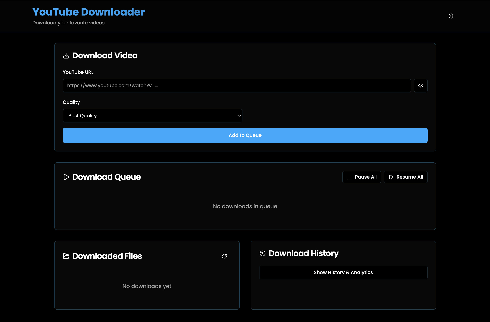

</td>
<td width="50%">

**Light Mode**

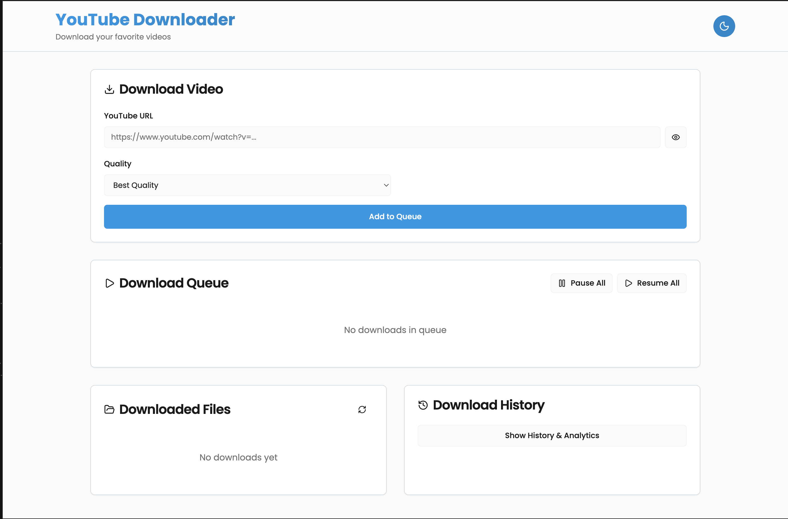

</td>
</tr>
</table>

### Download Queue & Progress

<table>
<tr>
<td width="50%">

**Download Queue with Progress**

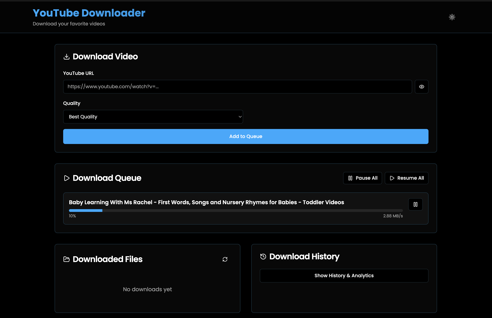

</td>
<td width="50%">

**Download Details**

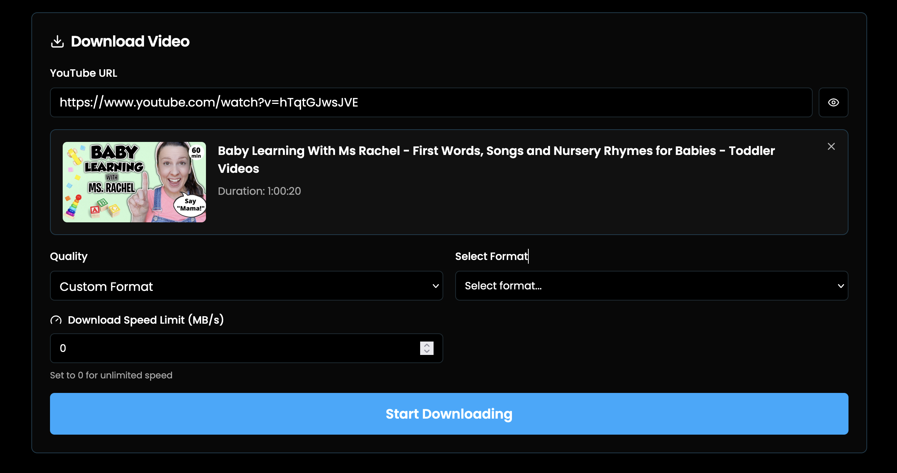

</td>
</tr>
</table>

### File Management

<table>
<tr>
<td width="50%">

**Downloaded Files & History**

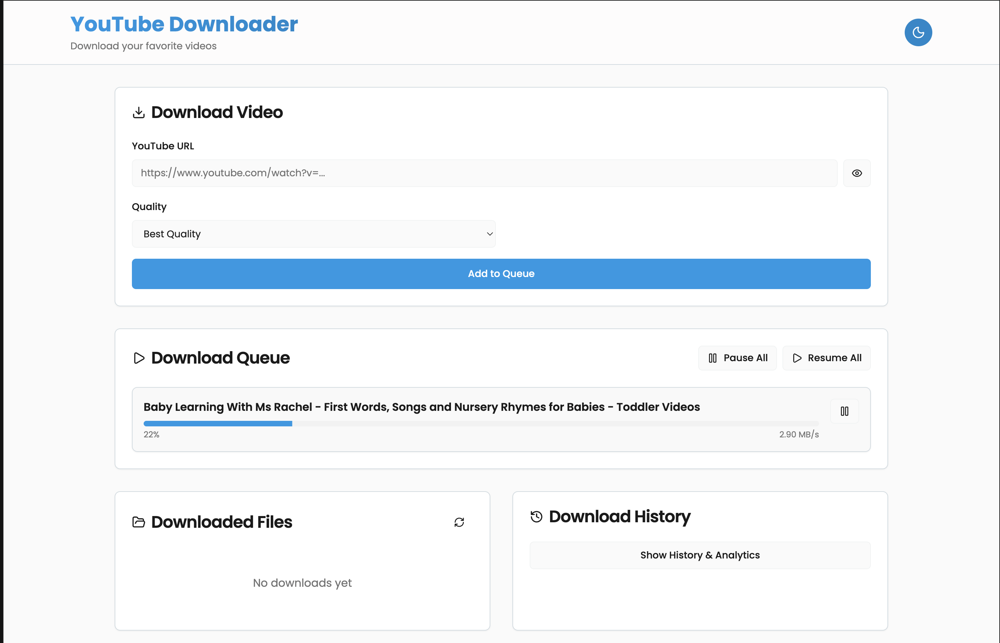

</td>
<td width="50%">

**Downloaded Files List**

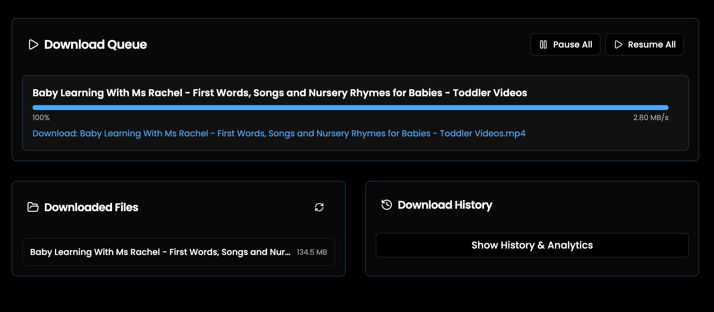

</td>
</tr>
</table>

### Format Selection & Custom Options

<table>
<tr>
<td width="50%">

**Format Selection List**

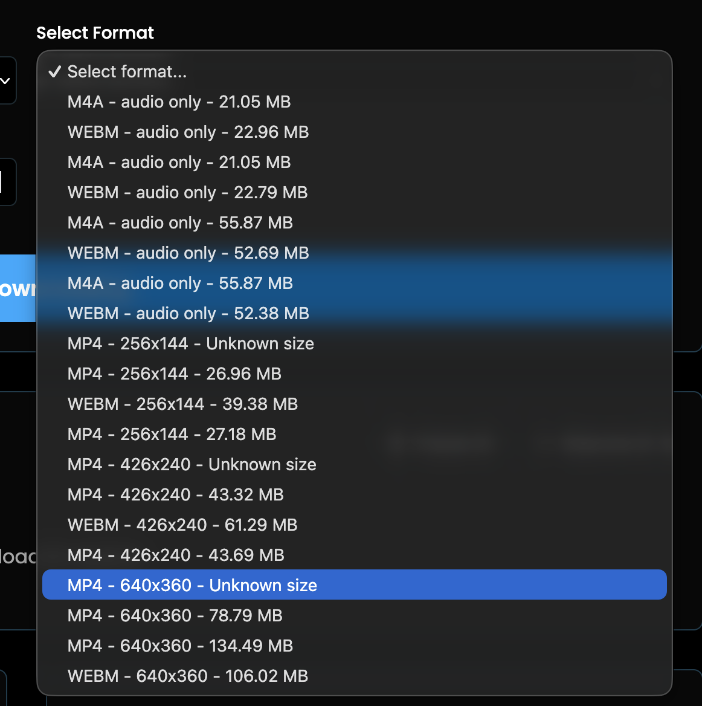

</td>
<td width="50%">

**Custom Format Options**

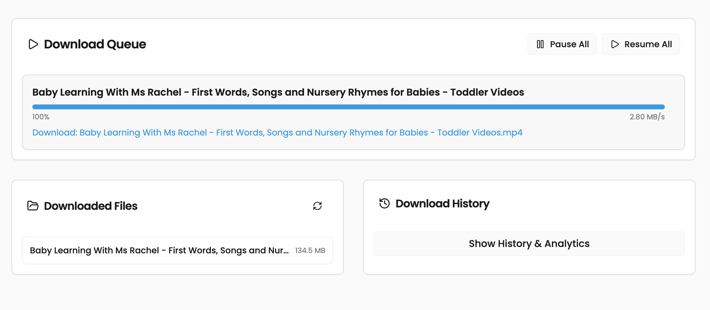

</td>
</tr>
</table>

### Additional Features

<table>
<tr>
<td width="50%">

**Video Preview**

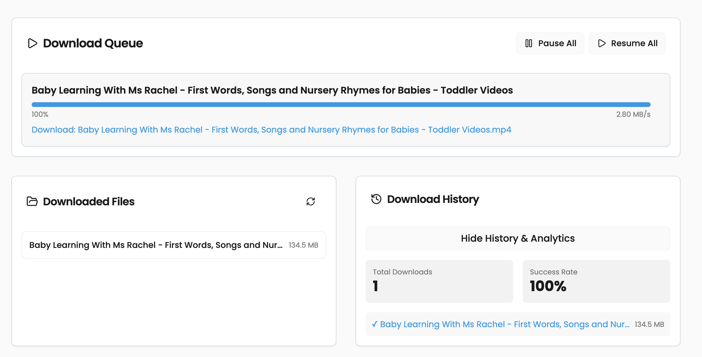

</td>
<td width="50%">

**Download Settings**

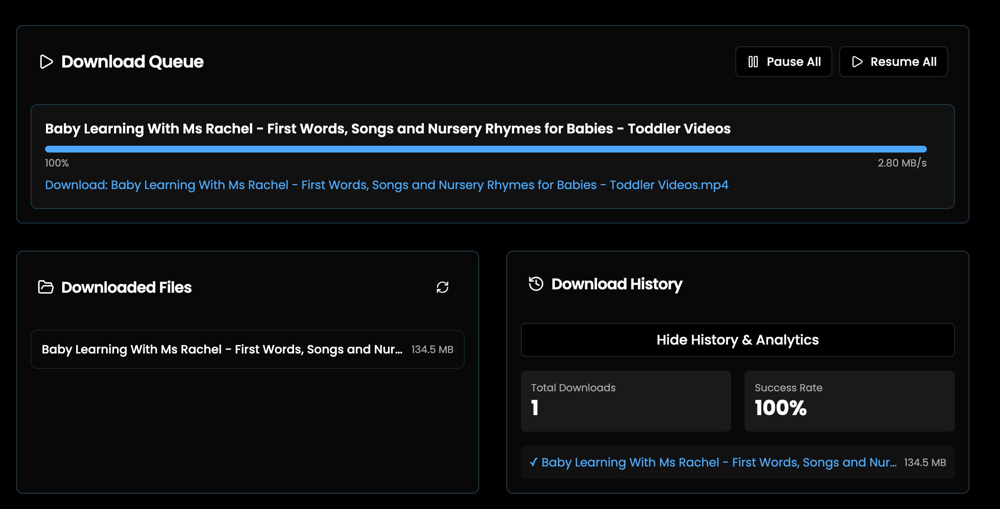

</td>
</tr>
</table>

<table>
<tr>
<td width="50%">

**Mobile View**

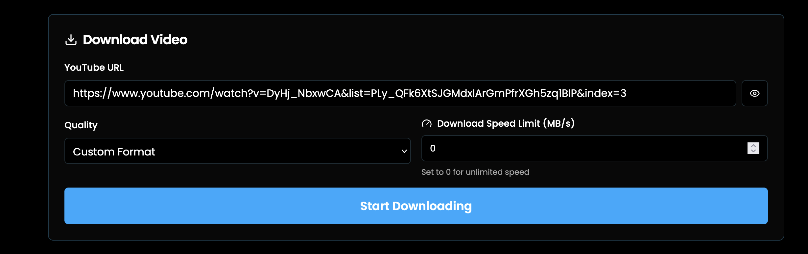

</td>
<td width="50%">

**Error Handling**

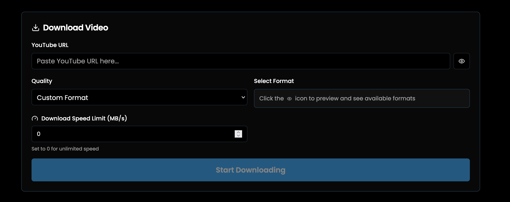

</td>
</tr>
</table>

## Installation

1. Create a virtual environment:
```bash
python -m venv venv
```

2. Activate the virtual environment:
   - On Windows (PowerShell):
   ```bash
   .\venv\Scripts\Activate.ps1
   ```
   - On Windows (Command Prompt):
   ```bash
   venv\Scripts\activate
   ```
   - On macOS/Linux:
   ```bash
   source venv/bin/activate
   ```

3. Install Python dependencies:
```bash
pip install -r requirements.txt
```

## Usage

1. Make sure the virtual environment is activated, then start the application:
```bash
python app.py
```

2. Open your web browser and go to:
```
http://localhost:5000
```

3. Paste a YouTube URL and click "Download Video"

## How to Use

1. Copy a YouTube video URL (from youtube.com or youtu.be)
2. Paste it into the URL field
3. Choose your preferred video quality
4. Click "Download Video"
5. Once downloaded, you can download the file from the "Downloaded Videos" section

## Requirements

- Python 3.12+
- Node.js 20+
- Flask 3.0+
- yt-dlp
- React 19+ (for frontend)

## Notes

- Downloaded videos are saved in your **Downloads/kids** folder on your computer:
  - **Windows**: `C:\Users\YourName\Downloads\kids`
  - **macOS**: `/Users/YourName/Downloads/kids`
  - **Linux**: `/home/YourName/Downloads/kids`
- The application runs on port 5000 by default
- Make sure you have enough disk space for downloaded videos
- Use the "Open Folder" button in the app to quickly access your downloaded videos

